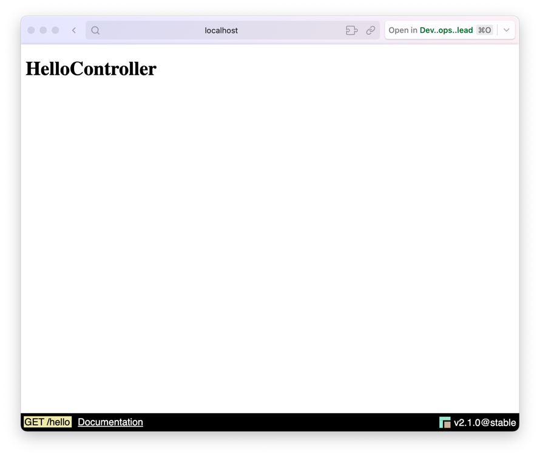

# Comment faire un controller ?

!!! info "Rappel d'un controller"

    Un contrôleur est l'intermédiaire entre le modèle et la vue. Il gère les événements utilisateur, effectue les traitements nécessaires et coordonne les mises à jour entre le modèle et la vue.

Pour créer un controller, rien de plus simple, la commande "edu" est là pour vous aider. 

Vous pouvez l'utiliser à la racine de votre projet en tapant la commande suivante :

```Shell
php bin/edu make:controller NOM_DU_CONTROLLER
```

N'oubliez pas de remplacer **"NOM_DU_CONTROLLER"** par le nom de votre controller.

<br>

# Exemple de création d'un controller

Nous allons créer un page "Hello" avec la commande suivante :

```Shell
php bin/edu make:controller Hello
```

La commande va générer un controller "HelloController.php" dans le dossier "src/Controller" et un fichier "hello.html.twig" dans le dossier "src/Template/hello".
Voici l'arborecence des fichiers générés :

``` hl_lines="5 8 9"
├── app
│   ├── Config
│   │   └── routes.yaml
│   ├── Controller
│   │   └── HelloController.php
│   └── Template
│       ├── base.html.twig
│       └── hello
│           └── hello.html.twig
```

### Le fichier HelloController.php
Cette commande va créer un fichier "HelloController.php" dans le dossier "src/Controller". 

```php 
<?php

namespace Controller;

use Studoo\EduFramework\Core\Controller\ControllerInterface;
use Studoo\EduFramework\Core\Controller\Request;
use Studoo\EduFramework\Core\View\TwigCore;
use Twig\Error\LoaderError;
use Twig\Error\RuntimeError;
use Twig\Error\SyntaxError;

class HelloController implements ControllerInterface
{
	public function execute(Request $request): string|null
	{
		return TwigCore::getEnvironment()->render('hello/hello.html.twig',
		    [
		        "titre"   => 'HelloController',
		        "request" => $request
		    ]
		);
	}
}
```

On peut voir que le controller HelloController implémente l'interface ControllerInterface. 

La méthode `execute()` prend en paramètre un objet de type [Request](../boost/resquet.md) et retourne une chaine de caractère (string) ou null.
La couche vue est gérée par le moteur de template Twig. On utilise la méthode `render()` de la classe TwigCore pour afficher le template "hello/hello.html.twig".
Deux variables sont passées au template : "titre" et "request".

!!! info

    Pour aller plus loin, vous pouvez lire la documentation de la classe [Request](../boost/resquet.md) pour comprendre comment gérer les requêtes HTTP.


### Le fichier hello.html.twig
Et va aussi créer un fichier "hello.html.twig" dans le dossier "src/Template/hello".

```twig


{{ titre }}


    <h1>{{ titre }}</h1>

```

Dans la vue "hello.html.twig", on affiche le titre de la page "HelloController" dans un h1. Une variable `{{ titre }}` est passée au template via le controller.

Vous pouvez accéder à votre controller en tapant l'url suivante : [http://localhost:8042/hello](http://localhost:8042/hello){:target="_blank"}

<figure markdown="span">

</figure>

## Modifier le fichier des routes
Et modifier le fichier des routes "config/routes.yaml" pour ajouter la route de votre controller.

```yaml
hello:
  uri: /hello
  controller: Controller\HelloController
  httpMethod: [GET]
```

Vous pouvez accéder à votre controller en tapant l'url suivante : [http://localhost:8042/hello](http://localhost:8042/hello){:target="_blank"}

Vous pouvez modifier le fichier des routes "config/routes.yaml" pour changer l'url de votre controller.
Remplacer "/hello" par "/bonjour" par exemple.

```diff
hello:
-  uri: /hello
+  uri: /bonjour
  controller: Controller\HelloController
  httpMethod: [GET]
```
Vous pouvez accéder à votre controller en tapant l'url suivante : [http://localhost:8042/bonjour](http://localhost:8042/bonjour){:target="_blank"}

Si nous allons de nouveau sur l'url [http://localhost:8042/hello](http://localhost:8042/hello){:target="_blank"}, une erreur `HTTP 404` sera retournée.
Pour rappel, l'erreur `HTTP 404 signifie que la ressource demandée (route) n'existe pas ou plus.


## Schema pour mieux comprendre le fonctionnement

<figure markdown="span">

</figure>